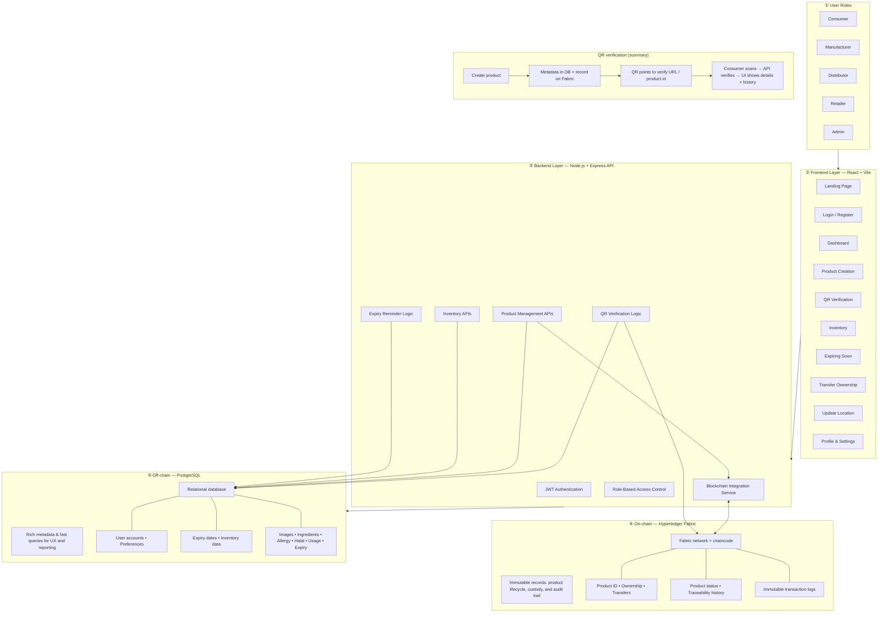
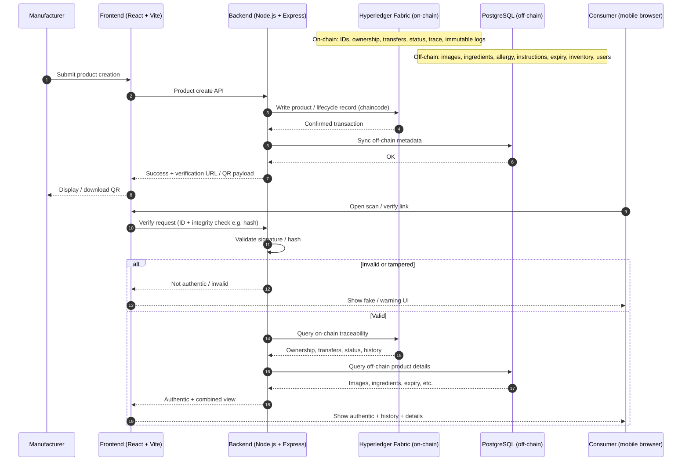

# Final Year Project — System Architecture Diagrams

**Project title:** Blockchain-Based Cosmetics & Skincare Product Authentication for SME Manufacturers and Consumers (Hyperledger Fabric)  

This markdown file contains **two Mermaid diagrams**: (1) main layered architecture and (2) QR verification workflow. Preview with:

- **VS Code / Cursor**: “Markdown Preview Mermaid Support” or the Mermaid extension  
- **GitHub**: renders Mermaid natively on `.md` preview  
- **Exported PDF**: paste into Typora / Obsidian / Mermaid Live Editor  

---

## 1. Main System Architecture Diagram

Shows **user roles** (primary: manufacturer/brand and consumer; supporting: distributor, retailer, regulator, admin), **frontend**, **backend**, split **on-chain (Fabric)** vs **off-chain (PostgreSQL)**, and **high-level QR verification** for cosmetics/skincare products.

**On-chain vs off-chain (short):**

| Domain | What it is for in this project |
|--------|--------------------------------|
| **On-chain (Fabric)** | Tamper-evident **identity of the product on the ledger**, **ownership / transfers**, **status changes**, and **append-only history** that supports anti-counterfeiting claims. |
| **Off-chain (PostgreSQL)** | **User accounts**, **UI-friendly product details** (images, ingredients, instructions), **expiry**, **inventory lists**, and **preferences** — updated quickly without putting large blobs on-chain. |

---

## 2. QR Verification Workflow Diagram

End-to-end flow from **product creation** through **QR generation**, **scanning**, and **authenticity outcome**.

---

## Legend (for slides / report)

- **Blue path (users → UI → API)**: normal application traffic.  
- **Green API box**: business rules, auth, and integration.  
- **Purple (Fabric)**: **on-chain** trust anchor.  
- **Orange (PostgreSQL)**: **off-chain** operational data.  

---

*Last updated: FYP documentation — system architecture overview.*
